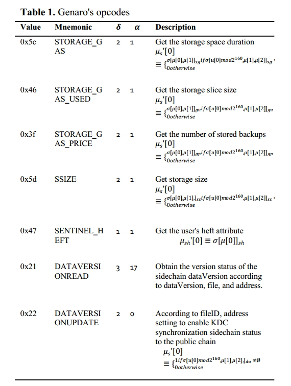
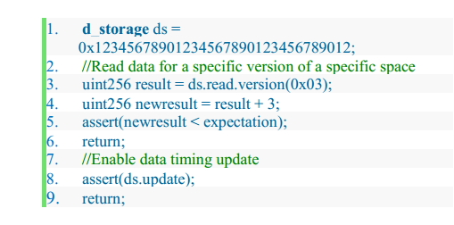
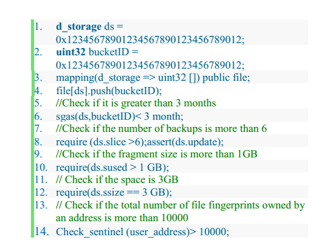

## solidity-genaro 

Fork from [solidity](https://github.com/ethereum/solidity/tree/v0.4.24).

## Building the source

    mkdir build
    cd build
    cmake .. && make
    
## How To Use

See [solidity](https://solidity.readthedocs.io/en/v0.4.24).  
New [feature](https://gnxtech.io/en/).  
You can get more development information from the [yellow book](https://github.com/GenaroNetwork/genaro-document).

### New VM opcodes

### New Instructions
After adding new opcodes, Genaro added new instructions
to the original solidity language and kept compatibility
while increasing the operational possibilities of the data.
Value type - increase part:
Storage address d_storage: Saves a 32-byte value
corresponding to the space address in the store. The storage
address type also has members as the basis for all storage
parts.  
Call method:  

Store the address to be queried, because in the smart
contract, you can stop the contract execution by using it as a
judgment point:  
